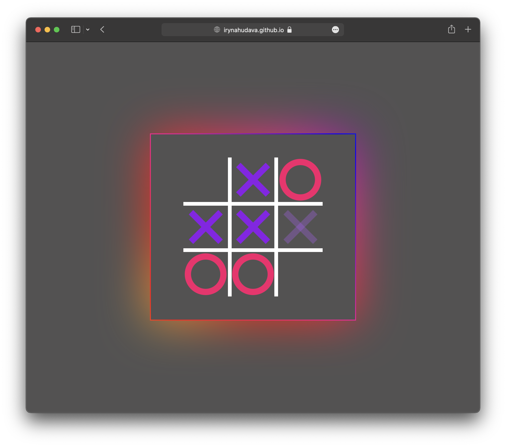
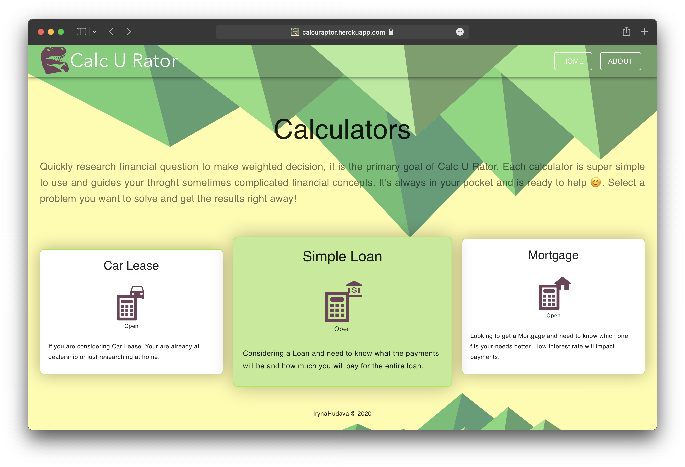
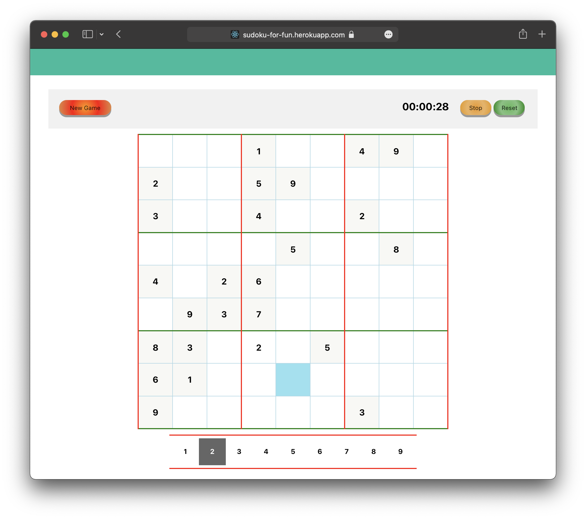

Projects created by Iryna Hudava

# Tic Tac Toe - GAME
- [Play](https://irynahudava.github.io/TicTacToeGame) Tic Tac Toe.
- [View Code](https://github.com/IrynaHudava/TicTacToeGame) on GitHub.

I wanted to challenge myself and build a WEB game with just HTML, CSS and JavaScript.

# Calc U Rator
- [Run](https://irynahudava.github.io/Projects) code on Heroku. _Please, give app's dyno a minute to wake up._
- [View Code](https://github.com/IrynaHudava/CalcuRator) on GitHub.

WEB application that implements three calculators: 
* Car lease
* Simple amortized loan
* Mortgage

I used React, Material UI and D3 JavaScript chart library to build the application. Unit tests and UI integration tests with cypress are used to ensure correctness.

# Sudoku - GAME
- [Play](https://sudoku-for-fun.herokuapp.com) on Heroku. _Please, give app's dyno a minute to wake up._
- [View Code](https://github.com/IrynaHudava/Sudoku) on GitHub.

A web game where I used just React without any component library.

# PokemonFinder
[View Code](https://github.com/IrynaHudava/PokemonFinderApp) on GitHub.

Web UI application and Node.js REST service. The application helps to find Pokémons buy multiple parameters. Fun project where I wanted to show my skills building REST services.